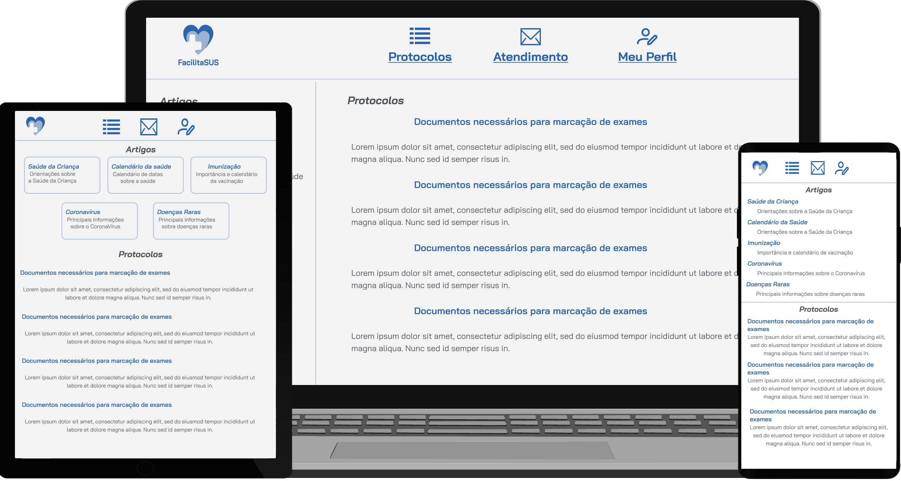

<h1 align="center">
  <a href="https://devduque.github.io/FacilitaSUS/src/LoginPage.html" target="_blank"> FacilitaSUS </a>
</h1>
  

  
  
  
   
  <a href="#-tecnologias">Tecnologias</a>&nbsp;&nbsp;&nbsp;|&nbsp;&nbsp;&nbsp;
  <a href="#-projeto">Projeto</a>&nbsp;&nbsp;&nbsp;|&nbsp;&nbsp;&nbsp;
  <a href="#-puc">PUC</a>&nbsp;&nbsp;&nbsp;|&nbsp;&nbsp;&nbsp;
  <a href="#-layout"> Layout </a>&nbsp;&nbsp;&nbsp;|&nbsp;&nbsp;&nbsp;
  

 

## 🚀 Tecnologias
Este projeto foi desenvolvido com as seguintes tecnologias:

💻 Código
- HTML
- CSS
- JS

🎨 Design
- Figma
- Mockups
- Ícones SVG

## 💻 Projeto
O projeto "FacilitaSUS" foi desenvolvido com o objetivo principal de eliminar burocracias e atrasos, proporcionando aos pacientes uma maneira mais rápida e eficiente de marcar exames e consultas médicas. A iniciativa concentra-se em fornecer um serviço de saúde mais acessível e conveniente, reduzindo a papelada e os processos morosos que muitas vezes impedem os pacientes de obterem os cuidados de que precisam.

## 🎓 PUC
Este projeto foi feito como um trabalho de desenvolvimento de sistemas, o design e o código são feitos pelo aluno, neste caso, eu.

## 🎨 Layout
Você pode visualizar o Layout [Neste Link](https://www.figma.com/file/qVLRaus8FdALBh34dFuDs3/Sus?type=design&node-id=0%3A1&mode=design&t=oe1XnUmfo3n7xGqp-1). Você precisa de uma conta no [Figma](http://figma.com/) para vê-lo.
